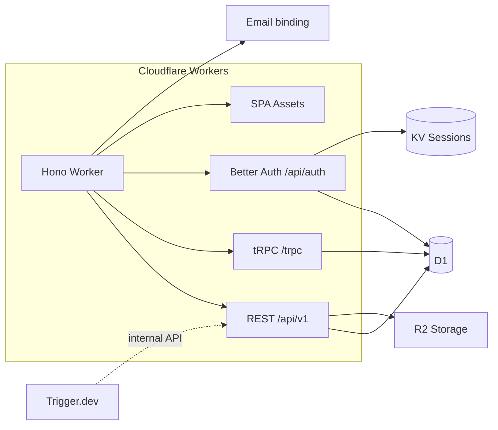

# Cloudflare SaaS Boilerplate

Production-minded monolith: **Hono** on **Cloudflare Workers**, **React 19** SPA (TanStack Router), **D1** + **Drizzle**, **Better Auth**, **Stripe** billing, **NFSe** via Fiscal Nacional, **Trigger.dev** jobs, **Cloudflare Email**, optional **Sentry** and **PostHog**.

## Architecture



- **Single Worker** serves the API and static client (`run_worker_first: true`).
- **Dashboard** uses **tRPC**; **REST** exposes webhooks and public API routes.
- **Background work** (e.g. NFSe polling) uses **Trigger.dev** calling an **internal** REST route.

## Quick start

1. **Clone and install**

   ```bash
   bun install
   ```

2. **Wrangler resources** — see [docs/DEPLOYMENT.md](./docs/DEPLOYMENT.md) and:

   ```bash
   bash scripts/setup.sh
   ```

   Update `wrangler.jsonc` with real `database_id` and KV IDs.

3. **Secrets**

   ```bash
   cp .dev.vars.example .dev.vars
   # fill values; then:
   bun db:migrate
   ```

4. **Develop (two processes)**

   ```bash
   bun dev          # Vite — http://localhost:5173
   bun cf:dev      # Worker — http://localhost:8787
   ```

   OAuth and cookie auth expect the Worker origin; use both together.

   Convenience: `bun run dev:all:wsl` or `bun run dev:all:mac`.

5. **Quality**

   ```bash
   bun run type-check
   bun run check
   bun test:run
   ```

## Documentation

| Doc | Purpose |
|-----|---------|
| [docs/DEPLOYMENT.md](./docs/DEPLOYMENT.md) | Staging/production deploy, secrets, Sentry maps |
| [docs/STRIPE_SETUP.md](./docs/STRIPE_SETUP.md) | Products, webhooks, test mode |
| [docs/NFSE_SETUP.md](./docs/NFSE_SETUP.md) | Fiscal Nacional **External API** (full reference) + boilerplate `nfse.ts` / ops (see “Relationship” + “Cloudflare SaaS boilerplate”) |
| [docs/EMAIL_SETUP.md](./docs/EMAIL_SETUP.md) | Cloudflare Email, DNS |
| [docs/TODO.md](./docs/TODO.md) | Task IDs and phases |

## Observability

- **Workers:** `SENTRY_DSN` secret + `@sentry/cloudflare` (Hono integration). Omit DSN to disable.
- **Browser:** `VITE_SENTRY_DSN` at Vite build time; `VITE_POSTHOG_KEY` / `VITE_POSTHOG_HOST` for PostHog.
- **Cloudflare:** `observability.enabled` in `wrangler.jsonc`.

## Cron

Daily **06:00 UTC** — deletes expired Better Auth `verification` and `session` rows (`triggers.crons` in `wrangler.jsonc`).

## Project layout

- `src/server/` — Hono app, tRPC routers, REST, services, Drizzle schema
- `src/client/` — React app, routes, UI
- `trigger/` — Trigger.dev tasks
- `test/` — Vitest + `@cloudflare/vitest-pool-workers`

## License

Private / your license — set in `package.json` as needed.
