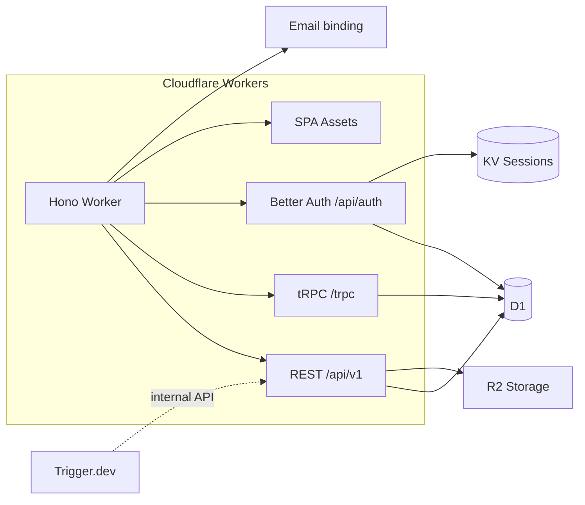

# Cloudflare SaaS Boilerplate

Production-minded monolith: **Hono** on **Cloudflare Workers**, **React 19** SPA (TanStack Router), **D1** + **Drizzle**, **Better Auth**, **Stripe** billing, **NFSe** via Fiscal Nacional, **Trigger.dev** jobs, **Cloudflare Email**, optional **Sentry** and **PostHog**.

## Architecture



- **Single Worker** serves the API and static client (`run_worker_first: true`).
- **Dashboard** uses **tRPC**; **REST** exposes webhooks and public API routes.
- **Background work** (e.g. NFSe polling) uses **Trigger.dev** calling an **internal** REST route.

## Quick start

### 1. Install dependencies

```bash
bun install
```

### 2. Create Wrangler resources (D1, KV, R2)

```bash
bash scripts/setup.sh
```

Then update `wrangler.jsonc` with the real `database_id` and KV namespace IDs printed by the script. See [docs/DEPLOYMENT.md](./docs/DEPLOYMENT.md) for details.

### 3. Configure secrets

```bash
cp .dev.vars.example .dev.vars
# Edit .dev.vars and fill in required values
```

Minimum required for local dev:

| Variable | Notes |
|----------|-------|
| `BETTER_AUTH_SECRET` | Any 32+ char random string |
| `STRIPE_API_KEY` | `sk_test_...` from Stripe dashboard |
| `STRIPE_WEBHOOK_SECRET` | From `bun stripe:listen` output |
| `INTERNAL_API_KEY` | Any random string (used by Trigger.dev) |

OAuth (`BETTER_AUTH_GOOGLE_*`, `BETTER_AUTH_GITHUB_*`) and NFSe/Trigger keys are optional for basic local dev.

### 4. Set up the database

```bash
bun db:migrate       # Apply all migrations to local D1
bun db:seed:local    # Insert seed users (see table below)
```

### 5. Start the development server

```bash
bun dev
# → http://localhost:5173  (client HMR + worker inline via @cloudflare/vite-plugin)
```

`bun dev` runs **both** the React client (with hot reload) and the Cloudflare Worker in the same Vite process — no separate wrangler needed.

Convenience script (also starts Trigger.dev if `TRIGGER_API_KEY` is set):

```bash
bun run dev:all:wsl   # WSL / Linux
bun run dev:all:mac   # macOS (opens Terminal tabs)
```

For local Stripe webhooks in a second terminal:

```bash
bun stripe:listen     # Forwards to localhost:5173/api/v1/webhooks/stripe
```

> **`bun cf:dev`** runs wrangler standalone (`--env local`) and is useful for testing production-like Worker behaviour. It requires `dist/client` to exist, but the updated script creates the directory automatically. Access the app via `bun dev` (port 5173) during normal development.

---

## Seed accounts

After running `bun db:seed:local` the following accounts are available:

| Email | Password | Plan | Credits |
|-------|----------|------|---------|
| `admin@example.com` | `Admin1234!` | Professional | 600 |
| `user@example.com` | `User1234!` | Free | 50 |

Both accounts have email already verified so you can sign in immediately without going through the email verification flow.

---

## Commands

### Development

| Command | Description |
|---------|-------------|
| `bun dev` | Vite + worker inline (port 5173) — primary dev command |
| `bun run dev:all:wsl` | Vite + Trigger.dev in parallel (WSL) |
| `bun run dev:all:mac` | Vite + Trigger.dev in separate tabs (macOS) |
| `bun cf:dev` | Wrangler standalone (`--env local`, port 8787) — production-like testing |

### Quality

| Command | Description |
|---------|-------------|
| `bun run type-check` | TypeScript check (`tsc -b`) |
| `bun run check` | Biome lint + format (auto-fix) |
| `bun test:run` | Vitest (single run) |
| `bun test` | Vitest (watch mode) |

### Database

| Command | Description |
|---------|-------------|
| `bun db:generate` | Generate Drizzle migrations from schema changes |
| `bun db:migrate` | Apply migrations to local D1 |
| `bun db:migrate:staging` | Apply migrations to staging D1 |
| `bun db:migrate:prod` | Apply migrations to production D1 |
| `bun db:seed:local` | Seed local database with dev accounts |
| `bun db:seed:staging` | Seed staging database (via wrangler remote) |
| `bun db:reset` | Reset local database (wipe data, keep schema) |
| `bun db:studio` | Open Drizzle Studio (local DB) |

### Build & Deploy

| Command | Description |
|---------|-------------|
| `bun build` | TypeScript + Vite build |
| `bun build:staging` | Build for staging environment |
| `bun build:production` | Build for production environment |
| `bun cf:check` | Type-check + build + dry-run deploy |
| `bun cf:deploy` | Deploy to production |
| `bun cf:deploy:staging` | Deploy to staging |

### Other

| Command | Description |
|---------|-------------|
| `bun stripe:listen` | Forward Stripe webhooks to local worker |
| `bun trigger:dev` | Trigger.dev local development |
| `bun i18n:extract` | Extract new i18n keys from source |
| `bun i18n:sync` | Sync translation files |

---

## Documentation

| Doc | Purpose |
|-----|---------|
| [docs/DEPLOYMENT.md](./docs/DEPLOYMENT.md) | Staging/production deploy, secrets, Sentry source maps |
| [docs/STRIPE_SETUP.md](./docs/STRIPE_SETUP.md) | Stripe products, webhooks, test mode |
| [docs/NFSE_SETUP.md](./docs/NFSE_SETUP.md) | Fiscal Nacional external API reference |
| [docs/EMAIL_SETUP.md](./docs/EMAIL_SETUP.md) | Cloudflare Email binding, DNS setup |
| [docs/TODO.md](./docs/TODO.md) | Task IDs and phases |

## CI/CD

Three GitHub Actions workflows in `.github/workflows/`:

| Workflow | Trigger | Jobs |
|----------|---------|------|
| `ci.yml` | Push to `main` | build · typecheck · lint · test |
| `pr-checks.yml` | PR to `main` | quality matrix · DB schema validation · test · security scan |
| `deploy-production.yml` | Push to `main` + manual | typecheck → build → D1 migrations → wrangler deploy |

**Required GitHub secrets** for the deploy workflow:
- `CLOUDFLARE_API_TOKEN` — Wrangler deploy token
- `CLOUDFLARE_ACCOUNT_ID`
- `VITE_SENTRY_DSN`, `VITE_POSTHOG_KEY`, `VITE_POSTHOG_HOST` (optional)
- `SENTRY_AUTH_TOKEN`, `SENTRY_ORG`, `SENTRY_PROJECT` (optional source maps)

## Observability

- **Workers:** `SENTRY_DSN` secret + `@sentry/cloudflare` (Hono integration). Omit the DSN to disable.
- **Browser:** `VITE_SENTRY_DSN` at Vite build time; `VITE_POSTHOG_KEY` / `VITE_POSTHOG_HOST` for PostHog analytics.
- **Cloudflare:** `observability.enabled` in `wrangler.jsonc`.

## Cron

Daily **06:00 UTC** — deletes expired Better Auth `verification` and `session` rows (`triggers.crons` in `wrangler.jsonc`).

## Project layout

```
src/
├── client/          # React SPA (TanStack Router, tRPC client, i18n)
│   ├── routes/      # File-based routes — (auth)/ and (protected)/
│   └── locales/     # i18n translation JSON files (en, pt-BR, es)
├── server/          # Hono worker
│   ├── db/          # Drizzle schema, migrations, seeds
│   ├── lib/         # Auth, tRPC, config, types
│   ├── routers/     # tRPC and REST route handlers
│   └── services/    # Business logic (billing, email, NFSe, PDF)
├── shared/          # Types shared between client and server
trigger/             # Trigger.dev background tasks
test/                # Vitest tests
```

## License

Private / your license — set in `package.json` as needed.
